<h1 align="center">
  
</h1>
<p align="center">
  
</p>
<p align="center">
  <strong>Compiler Testing · Automatic Code Generation · Code LLMs · Intelligent Software Engineering · Automated Testing</strong>
</p>
<p align="center">
  我关注编译器测试、代码自动生成、代码大模型、智能化软件工程以及自动化测试，
  也持续在软件开发全栈和相关前沿研究方向打磨项目。
</p>

<p align="center">
  
  
  
  
  
</p>

## About Me

- Focus on compiler testing, automatic code generation, and Code LLMs.
- Interested in exploring intelligent software engineering and advancing automated testing workflows.
- Build practice-oriented projects across HarmonyOS, Java Web, and front-end applications.

## Current Focus

- Compiler testing and validation
- Automatic code generation & Code LLMs
- Intelligent software engineering
- Automated testing frameworks

## Featured Projects

| Project                                                                            | What It Shows                                                                                          | Stack                  |
| ---------------------------------------------------------------------------------- | ------------------------------------------------------------------------------------------------------ | ---------------------- |
| [database-designer-lite](https://github.com/RainFly-code/database-designer-lite)   | A lightweight database design helper for personal projects, graduation projects, and fast prototyping. | Design / SQL           |
| [StudyGo](https://github.com/RainFly-code/StudyGo)                                 | A HarmonyOS study-room reservation system with dual-end interaction experience.                        | TypeScript / HarmonyOS |
| [StudyGo-backend](https://github.com/RainFly-code/StudyGo-backend)                 | Backend service for StudyGo, focused on practical API design and service support.                      | Java / Spring Boot     |
| [TeacherOrderingSystem](https://github.com/RainFly-code/TeacherOrderingSystem)     | A reservation system project with a clear business scenario and complete front-end implementation.     | JavaScript             |
| [HarmonyOS-Study-Example](https://github.com/RainFly-code/HarmonyOS-Study-Example) | A hands-on repository for HarmonyOS feature exploration and development practice.                      | TypeScript             |
| [JavaWeb_Shopping_Mall](https://github.com/RainFly-code/JavaWeb_Shopping_Mall)     | A Java Web shopping mall practice project that reflects full-stack learning and implementation.        | Java                   |

## Tech Stack

```text
Languages:   Python, Java, TypeScript, JavaScript
Frontend:    Vue, HarmonyOS UI, Web Applications
Backend:     Spring Boot, Java Web
Research:    Compiler Testing, Code Generation, Code LLMs, Intelligent SE, Automated Testing
Tooling:     Crawlers, CSV Pipelines, Database Design Drafting
```

## GitHub Stats

<p align="center">
  
  
</p>

<p align="center">
  <picture>
    <source media="(prefers-color-scheme: dark)" srcset="https://raw.githubusercontent.com/RainFly-code/RainFly-code/output/github-contribution-grid-snake-dark.svg">
    <source media="(prefers-color-scheme: light)" srcset="https://raw.githubusercontent.com/RainFly-code/RainFly-code/output/github-contribution-grid-snake.svg">
    
  </picture>
</p>

## Looking Ahead

- Share more compiler testing and automatic code generation work as public technical projects
- Keep improving project documentation and project presentation quality
- Build a cleaner portfolio around intelligent software engineering and automated testing

## Find Me Here

- GitHub: [@RainFly-code](https://github.com/RainFly-code)
