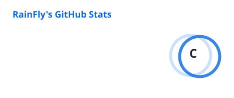
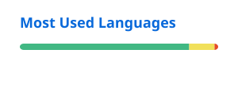

<h1 align="center">
  
</h1>
<p align="center">
  
  <a href="https://ghfind.com/u/rainfly-code?ref=badge">
    
  </a>
</p>
<p align="center">
  <strong>Software Engineering · AI Tooling · Full-Stack Development · Open Source Practice</strong>
</p>
<p align="center">
  我热爱用技术解决真实问题，持续在软件工程、AI 工具、全栈开发和开源实践中探索成长。
  <br />
  永远相信美好的事情即将发生。
</p>

<p align="center">
  
  
  
  
  
</p>

## About Me

- Explore practical software engineering, AI tooling, and full-stack development.
- Enjoy turning ideas into usable projects with clear structure and thoughtful details.
- Keep learning, building, and sharing through open source practice.

## Current Focus

- Practical AI-assisted development workflows
- Full-stack project polishing and product-oriented implementation
- Developer tooling, automation, and productivity experiments
- Clearer documentation and stronger open source presentation

## Tech Stack

```text
Languages:   Python, TypeScript, JavaScript, SQL
Frontend:    Vue, Web Applications, UI Practice
Focus:       Software Engineering, AI Tooling, Full-Stack Development
Tooling:     Automation, Developer Workflows, Database Design, GitHub Practice
```

## GitHub Stats

<p align="center">
  
  
</p>

<p align="center">
  <a href="https://ghfind.com/u/rainfly-code?ref=badge">
    
  </a>
</p>

<p align="center">
  <picture>
    <source media="(prefers-color-scheme: dark)" srcset="https://raw.githubusercontent.com/RainFly-code/RainFly-code/output/github-contribution-grid-snake-dark.svg">
    <source media="(prefers-color-scheme: light)" srcset="https://raw.githubusercontent.com/RainFly-code/RainFly-code/output/github-contribution-grid-snake.svg">
    
  </picture>
</p>

## Looking Ahead

- Continue refining these four repositories with clearer documentation and stronger project presentation
- Share more work around AI-assisted development, full-stack practice, and useful tooling
- Build a cleaner open source portfolio around projects, experiments, and practical learning

## Find Me Here

- GitHub: [@RainFly-code](https://github.com/RainFly-code)
